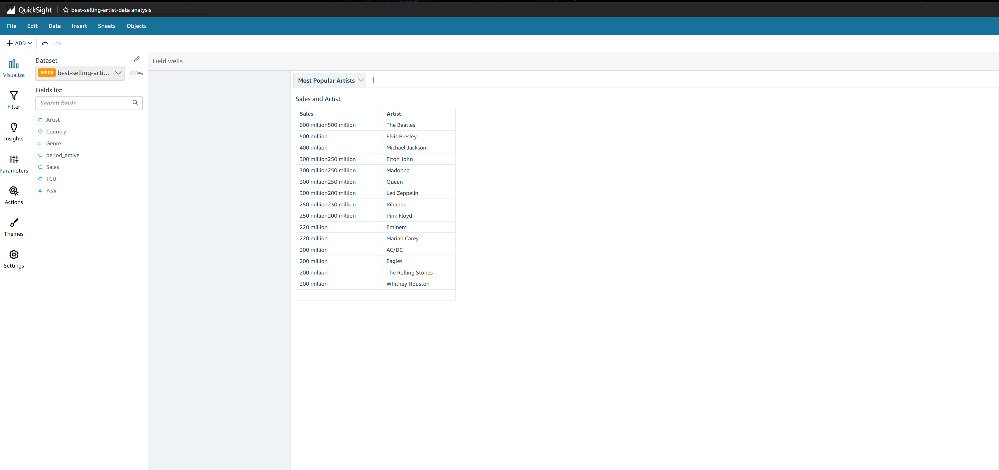

## bestsellingartistAWSQS
Visualizing Best Selling Artist Data using Amazon QuickSight

## Services/ Tools Used:
- Amazon S3
- Amazon QuickSight

## Storing Dataset in Amazon S3 Bucket
- Created an S3 bucket *ryan-best-artist-project* and left the settings at default. This is where I'll store the CSV file and manifest.json file. I edited the bucket name to the bucket I created.

```js

{
   "fileLocations": [
       {
           "URIs": [
               "s3://[BUCKET_NAME]/best_selling_artists.csv"
           ]
       }
   ],
   "globalUploadSettings": {
       "format": "CSV",
       "delimiter": ",",
       "textqualifier": "\"",
       "containsHeader": "true"
   }
}
```
## QuickSight 
 - Created a QuickSight account and ensured the S3 bucket I created was selected.

 - Created a dataset and uploaded from a S3 datasource by copying the URL of the manifest.json file that in the bucket I created. This gives directions on how to handle the CSV file.

 - Created a pivot table showing artists that sold over 200 million records.



